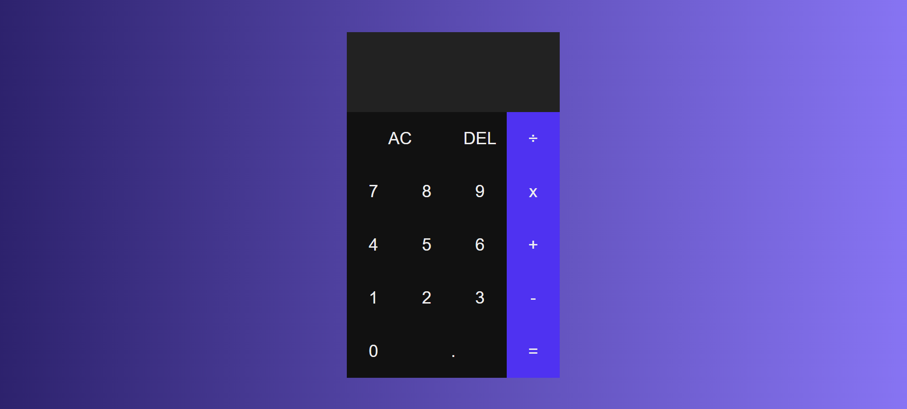

## 📋 Sobre o Projeto

O projeto consiste em uma calculadora simples desenvolvida durante o segundo semestre do curso de Engenharia de Software.

### 🛠️ Tecnologias Utilizadas

- HTML
- CSS
- JavaScript

### 🖼️ Imagem do Projeto

     

